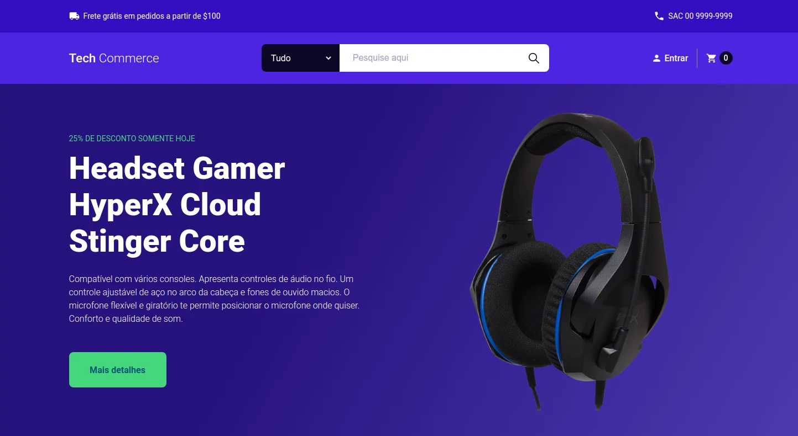

# Tech-commerce

E-commerce simples utilizando Next.js.

Acessar a demonstração: https://tech-commerce-two.vercel.app

  

## ⚙️ Tecnologias

- HTML5/CSS3
- ReactJS
- Styled-components
- Next.js

## 🚀 Como executar

- Clone o repositório
- Instale as dependências com `yarn`
- Inicie o servidor de desenvolvimento com `yarn dev`

Agora você pode acessar [`localhost:3000`](http://localhost:3000) no navegador.
